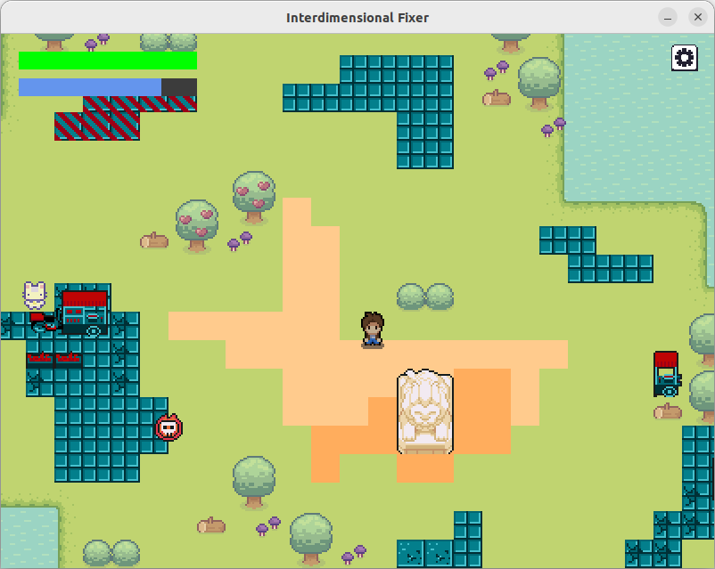
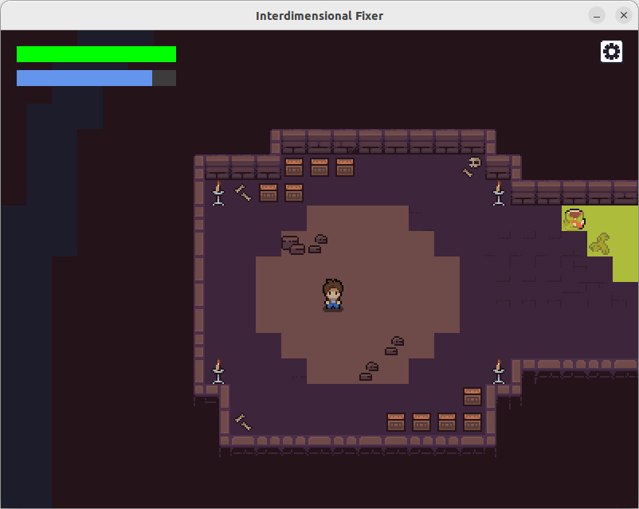
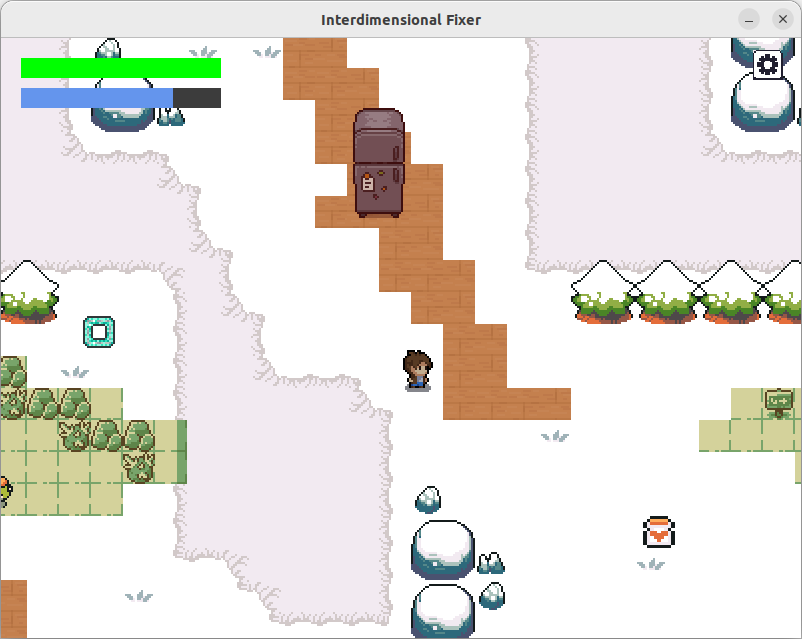

# INTERDIMENSIONAL FIXER

A 2D top-down action game. 

The player explores levels, fights enemies using melee attacks, and searches for buttons to restore the dimension before their sanity runs out.

## Features

- Player movement and melee combat
- Enemy entities with varying movement behaviors
- Health system
- Sanity system that works as an in-level timer
- Consumables to restore health and sanity
- 3 levels collaged from different asset packs
- Layer system to modify the level map as the player progresses

## How to Play

Each level has two buttons the player must find to restore the home dimension. Find them to win the level! 

Watch out for your health (green bar) and your sanity (blue bar). If any of them drop to 0, it's game over. Sanity is lost over time, so be quick!

### Controls

| Key | Action |
|---|---|
| `W` `A` `S` `D` | Move |
| `Right click` | Attack in the facing direction |
| `Right click / Left click` | Interact |


## How to Compile

### Requirements

Install the following libraries:

- SDL2
- SDL2_image
- SDL2_ttf
- SDL2_mixer
- Lua

### Build

```bash
make
```

### Run

```bash
make run
```

## Asset Credits

### Art

- [Mystic Woods](https://game-endeavor.itch.io/mystic-woods)
- [EASY SPACE! - Banana Pack](https://meowmeowexpress.itch.io/easy-space)
- [Sprout Lands](cupnooble.itch.io/sprout-lands-asset-pack)
- [Neo Zero](https://yaninyunus.itch.io/neo-zero-cyberpunk-city-tileset)
- [Ninja Adventure](https://pixel-boy.itch.io/ninja-adventure-asset-pack)
- [2D Pixel Dungeon Asset Pack](https://pixel-poem.itch.io/dungeon-assetpuck)
- [Free Top-Down Pixel Dungeon Level Game Assets](https://free-game-assets.itch.io/free-2d-top-down-pixel-dungeon-asset-pack)
- [Super Gameboy Quest](https://toadzillart.itch.io/dungeons-pack)
- [Top-Down Retro Interior](https://penzilla.itch.io/top-down-retro-interior)

### Audio

- [Ninja Adventure](https://pixel-boy.itch.io/ninja-adventure-asset-pack)

### Fonts

- [Press Start 2P](https://fonts.google.com/specimen/Press+Start+2P)

## Screenshots







## Future Improvements

- Additional enemy types and incentives for fighting
- More levels and environments
- Improved combat mechanics

## Known Issues

- Attack hitbox placement needs improvement.
- Additional polish and optimization are still in progress.
